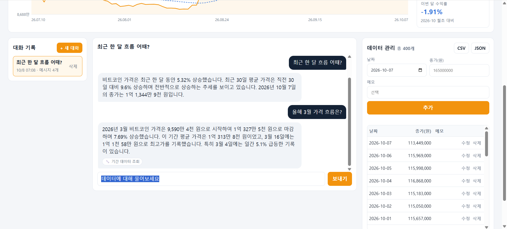
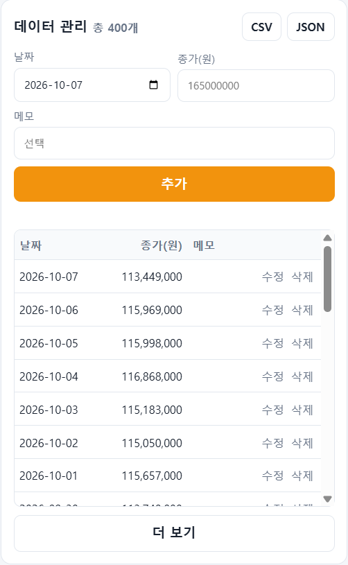
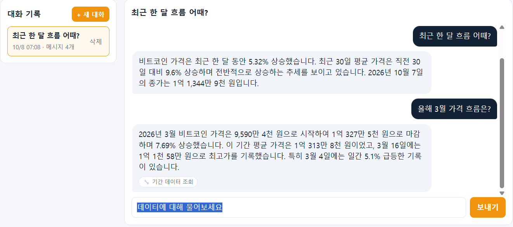
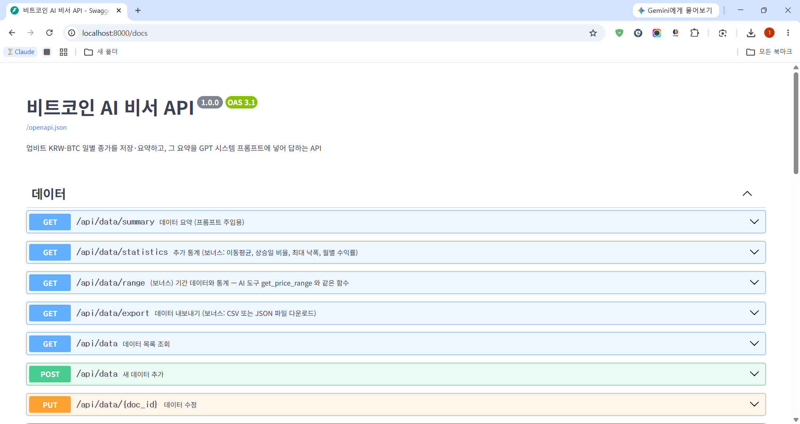
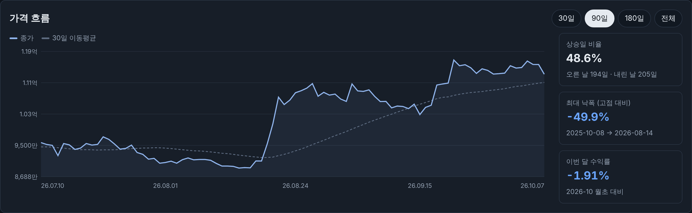

# 비트코인 AI 비서 (crypto-ai-assistant)

업비트 비트코인(KRW-BTC) 일별 종가 데이터를 저장·요약하고, **그 요약을 근거로 대화로 답하는 AI 비서** 웹 서비스입니다.

## 1. 서비스 소개

### 왜 만들었나
- ChatGPT에 "요즘 비트코인 어때?"라고 물으면 내 데이터를 모르기 때문에 일반적인 이야기만 하거나 숫자를 지어낼 수 있다.
- 업비트 차트는 숫자는 정확하지만 "지난달보다 올랐어?", "제일 많이 떨어진 날은?" 같은 질문에는 답해 주지 않는다. 직접 표를 보고 계산해야 한다.
- 그래서 **저장된 실제 시세 데이터만 근거로, 쉬운 말로 답하는 비서**를 만들었다.

### 무엇이 좋은가
| 대상 | 이로운 점 |
|---|---|
| 코인 초보자 | 차트를 읽지 못해도 "요즘 오르는 중이야?"라고 물으면 쉬운 말로 답을 듣는다 |
| 바쁜 직장인·학생 | 매일 차트를 보지 않아도 질문 한 번으로 흐름을 파악한다 |
| 급락에 불안한 사람 | "이 정도 하락이 자주 있었어?"에 과거 급락 기록으로 답해, 감정이 아닌 데이터로 판단하게 돕는다 |

- **정확성**: AI는 시스템 프롬프트에 넣은 데이터 요약 안에서만 답하고, 없는 정보는 "데이터에 없다"고 말한다.
- **최신성**: 화면에서 데이터를 추가·수정·삭제하면 요약이 즉시 다시 계산되고 AI 답변에도 반영된다.
- **안전성**: 매매 신호는 항상 사유·반대 근거·과거 적중률과 함께 보여 주고, 단정하지 않으며 "투자 판단은 본인 책임"을 붙이도록 규칙을 넣었다.

## 2. 주요 기능
1. **데이터 기반 AI 채팅**: 질문 → 데이터 요약을 시스템 프롬프트에 주입 → GPT 답변 (로딩 표시)
2. **데이터 관리(CRUD)**: 날짜·종가·메모 추가, 목록, 수정, 삭제
3. **대화 기록**: 채팅 자동 저장, 목록 조회, 이전 대화 불러오기, 삭제
4. **데이터 요약 표시**: 기간, 개수, 최근 종가, 30일 변화, 추세
5. **(보너스) AI 도구 호출 + MCP 연동**: GPT 가 필요할 때 기간 조회·통계 등 내부 기능을 스스로 호출, 같은 도구를 Claude 데스크톱에서 MCP 로 사용
6. **(보너스) 인사이트·UX 고도화**: 가격 그래프(30일/90일/180일/전체 선택), 추가 통계 3종, CSV·JSON 내보내기, 다크 모드

## 3. 기술 스택
| 구분 | 사용 기술 |
|---|---|
| 백엔드 | Python 3.11, FastAPI, Pydantic, Uvicorn |
| DB | Firebase Firestore (`firebase-admin`) |
| AI | `openai` 패키지 (OpenAI 호환 Chat Completions + Function Calling). 배포는 무료 키로 Google Gemini(`gemini-2.5-flash`)의 OpenAI 호환 주소를 사용, 환경 변수만 바꾸면 GPT(`gpt-4o-mini`)로 동작 |
| 프론트엔드 | HTML / CSS / JavaScript (프레임워크 없음) |
| 배포 | Render (백엔드), Vercel (프론트엔드) |
| 데이터 | 업비트 시세 API (KRW-BTC 일봉, 400일) |

## 4. 배포 URL
| 구분 | 주소 |
|---|---|
| 프론트엔드 (Vercel) | https://crypto-ai-assistant-frontend-lake.vercel.app |
| 백엔드 API (Render) | https://crypto-ai-assistant-j7ge.onrender.com |
| Swagger UI | https://crypto-ai-assistant-j7ge.onrender.com/docs |

> Render 무료 티어는 15분간 요청이 없으면 잠들어, 첫 접속에 30초~1분이 걸릴 수 있습니다. 화면 상단에 "서버 깨우는 중" 안내가 뜨고, 서버가 깨면 자동으로 데이터를 불러옵니다.

## 5. 프로젝트 구조
```
crypto-ai-assistant/
├── backend/
│   ├── main.py                    # FastAPI 앱, CORS, 라우터 등록
│   ├── app/
│   │   ├── config.py              # 환경 변수 읽기
│   │   ├── db.py                  # Firestore 연결 (키 없으면 메모리 저장소)
│   │   ├── schemas.py             # Pydantic 요청/응답 모델 (입력 검증)
│   │   ├── routers/               # URL 과 HTTP 처리만 담당
│   │   │   ├── data.py            #   /api/data (CRUD + summary)
│   │   │   ├── conversations.py   #   /api/conversations
│   │   │   └── chat.py            #   /api/chat
│   │   └── services/              # 실제 로직
│   │       ├── data_service.py    #   CRUD, 요약 통계 계산
│   │       ├── conversation_service.py
│   │       └── chat_service.py    #   시스템 프롬프트 구성, GPT 호출, 자동 저장
│   │       └── tools.py           #   (보너스) AI 도구 정의·실행 (Function Calling)
│   ├── scripts/seed_upbit.py      # 업비트 데이터 수집·분석·Firestore 업로드
│   ├── data/btc_daily.csv         # 수집한 원본 데이터
│   ├── requirements.txt
│   └── .env.example
├── frontend/
│   ├── index.html / style.css / app.js
│   ├── config.js                  # 로컬용 API 주소
│   ├── build.js                   # Vercel 빌드 시 API_BASE_URL 로 config.js 생성
│   └── vercel.json
├── mcp_server/                    # (보너스) MCP 서버 — Claude 데스크톱에서 같은 도구 사용
│   ├── server.py
│   └── requirements.txt
├── docs/
│   ├── GLOSSARY.md                # 과제 용어 정리
│   └── screenshots/
└── render.yaml
```

**라우터와 서비스를 나눈 기준**: 라우터는 "어떤 URL로 무엇을 받고 어떤 상태 코드를 돌려줄지"만, 서비스는 "데이터를 어떻게 계산·저장할지"만 맡는다. 그래서 `/api/chat` 이 `/api/data/summary` 와 같은 요약 함수(`build_summary`)를 그대로 재사용할 수 있다.

## 6. API
| 메서드 | 경로 | 설명 |
|---|---|---|
| POST | `/api/data` | 새 데이터 추가 (같은 날짜가 있으면 409) |
| GET | `/api/data` | 목록 조회 (`?order=desc&limit=30`) |
| PUT | `/api/data/{id}` | 수정 (바꿀 항목만 전송) |
| DELETE | `/api/data/{id}` | 삭제 |
| GET | `/api/data/summary` | 요약 (프롬프트 주입용) |
| GET | `/api/data/range?start=&end=` | (보너스) 기간 데이터 + 기간 통계 (AI 도구와 같은 함수) |
| GET | `/api/data/statistics` | (보너스) 추가 통계 + 그래프용 시계열 |
| GET | `/api/data/export?format=csv` | (보너스) CSV 또는 JSON 파일 다운로드 |
| POST | `/api/conversations` | 대화 저장 |
| GET | `/api/conversations` | 대화 목록 (**messages 미포함**, 개수만) |
| GET | `/api/conversations/{id}` | 특정 대화 불러오기 (**messages 포함**) |
| DELETE | `/api/conversations/{id}` | 대화 삭제 |
| POST | `/api/chat` | AI 대화 (요약 주입 + 필요 시 도구 호출 + 자동 저장). 응답에 `tool_calls` 포함 |
| GET | `/api/signals` | (보너스) 오늘의 매매 신호 + 근거 + 7일 예상 범위 + 과거 적중률 |
| GET | `/api/news?q=&limit=` | (보너스) 최근 7일 뉴스 헤드라인 (구글 뉴스 RSS) |
| POST | `/api/alerts/run` | (보너스) 시세 갱신 → 신호 계산 → 디스코드 알림. `X-Alert-Token` 헤더 필요 |
| POST | `/api/market/update` | (보너스) 업비트에서 빠진 날짜 시세만 추가. `X-Alert-Token` 헤더 필요 |

### 요약 응답 예시 (`GET /api/data/summary`)
```json
{
  "name": "비트코인 일별 종가 (업비트 KRW-BTC)",
  "period": "2025-09-03 ~ 2026-10-07",
  "count": 400,
  "metrics": {
    "latest": {"date": "2026-10-07", "value": 165000000},
    "average": 140000000,
    "max": {"date": "...", "value": 0},
    "min": {"date": "...", "value": 0},
    "change_30d_pct": 4.2,
    "daily_volatility_pct": 2.4
  },
  "trend": "상승 (최근 30일 평균이 직전 30일 대비 +4.2%)"
}
```

### 컨텍스트 주입 흐름 (`POST /api/chat`)
```
사용자 질문
  → ① data_service.build_summary()  : 요약 계산 (/api/data/summary 와 같은 함수)
  → ② 요약을 시스템 프롬프트에 삽입   : "당신은 데이터 분석 비서입니다. [사용자 데이터 요약] ..."
  → ③ 이전 대화 최대 10개 + 질문과 함께 GPT 호출 (max_tokens 500)
  → ④ 질문·답변을 conversations 에 자동 저장
  → 답변 + conversation_id 반환
```

## 7. 보너스 ①: AI 도구 호출(Function Calling) + MCP 연동

### 왜 필요한가
요약(컨텍스트 주입)만으로는 "3월 가격 흐름은?"처럼 **특정 기간**을 물으면 월별 평균 정도밖에 모른다. 그래서 GPT 에게 내부 기능을 "도구"로 쥐여 주고, 필요할 때만 직접 호출해 정확한 숫자를 가져오게 했다.

### 도구 목록과 호출 근거
GPT 는 각 도구의 `description` 을 읽고 질문에 맞는 도구를 고른다 (`tool_choice: "auto"`).

| 도구 | 하는 일 | GPT 가 호출하는 근거(질문 예) |
|---|---|---|
| `get_price_range(start_date, end_date)` | 기간의 일별 종가 + 시작·끝 가격, 변화율, 최고·최저 | 날짜·기간이 정해진 질문 — "3월 가격 어땠어?", "지난주 흐름" |
| `get_statistics()` | 상승일 비율, 최대 낙폭(MDD), 월별 수익률 | "몇 번 올랐어?", "가장 크게 떨어진 구간은?", "6월 수익률" |
| `get_data_summary()` | 전체 요약 (시스템 프롬프트와 같은 내용) | 대화가 길어져 최신 요약을 다시 확인할 때 |
| `get_market_signals()` | 오늘의 매매 신호 + 근거 + 7일 예상 범위 + 과거 적중률 | "지금 살까?", "팔아야 해?", "앞으로 어떨까?" |
| `get_recent_news(query)` | 최근 7일 뉴스 헤드라인 | "요즘 왜 떨어져?", "뉴스 알려줘", 살까/팔까 질문의 근거 |
| `list_conversations()` | 저장된 대화 목록 | "지난번에 뭐 물어봤지?" |

- 요약에 이미 답이 있는 질문("최근 흐름 어때?")은 **도구를 부르지 않고** 바로 답한다 → 불필요한 호출·비용을 줄인다.
- 어떤 도구를 불렀는지는 응답의 `tool_calls` 와 저장된 메시지의 `tools_used` 에 남고, 화면에는 답변 아래 `🔧 기간 데이터 조회` 처럼 표시된다.
- 도구 호출은 최대 3회까지만 주고받는다 (무한 반복·비용 방지). 잘못된 인자(예: 날짜 형식 오류)는 오류 내용을 GPT 에 돌려줘 스스로 고치게 한다.

### 호출 흐름 (웹 채팅)
```
사용자: "올해 3월 가격 흐름은?"
 ① 백엔드: 요약을 시스템 프롬프트에 넣고 + 도구 목록(tools)과 함께 GPT 호출
 ② GPT: "요약엔 3월 일별 값이 없다" → get_price_range("2026-03-01", "2026-03-31") 호출 요청
 ③ 백엔드: tools.run_tool() 로 Firestore 데이터 계산 → 결과(JSON)를 role=tool 메시지로 전달
 ④ GPT: 결과를 읽고 최종 답변 "3월은 ○○원에서 ○○원으로 +6.98% …"
 ⑤ 백엔드: 질문·답변·사용 도구를 conversations 에 저장 → 화면에 답변 + 🔧 표시
```

### MCP 연동 (외부 채널: Claude 데스크톱)
같은 기능을 **MCP(Model Context Protocol) 서버**로도 열었다. Claude 데스크톱에서 "내 비트코인 데이터 3월 흐름 알려 줘"라고 하면, Claude 가 MCP 도구를 골라 배포된 API 를 호출한다.

```
[Claude 데스크톱] ──MCP(stdio)──> [mcp_server/server.py] ──HTTP──> [Render API] ──> [Firestore]
                                                      └─ ask_assistant ─> /api/chat ─> GPT (+ Function Calling)
```

| MCP 도구 | 호출하는 API |
|---|---|
| `get_data_summary` | `GET /api/data/summary` |
| `get_statistics` | `GET /api/data/statistics` |
| `get_price_range` | `GET /api/data/range` |
| `list_conversations`, `get_conversation` | `GET /api/conversations`, `GET /api/conversations/{id}` |
| `ask_assistant` | `POST /api/chat` (웹의 GPT 비서에게 질문, 대화도 저장됨) |

**설정 방법 (Windows)**
```bash
cd mcp_server
python -m venv venv
venv\Scripts\activate
pip install -r requirements.txt
```
Claude 데스크톱 → 설정 → 개발자 → 구성 편집 (`%APPDATA%\Claude\claude_desktop_config.json`) 에 추가하고 앱을 재시작한다.
```json
{
  "mcpServers": {
    "bitcoin-ai-assistant": {
      "command": "<프로젝트 경로>\\mcp_server\\venv\\Scripts\\python.exe",
      "args": ["<프로젝트 경로>\\mcp_server\\server.py"],
      "env": { "API_BASE_URL": "https://crypto-ai-assistant-j7ge.onrender.com" }
    }
  }
}
```
검증: Claude 데스크톱에서 "bitcoin-ai-assistant 도구로 3월 가격 흐름 알려 줘" → `get_price_range` 호출 허용 → 답변 확인.

## 8. 보너스 ②: 인사이트·UX 고도화
| 요구 사항 | 구현 |
|---|---|
| 추가 지표 1개 이상 | `/api/data/statistics` 신설 + `/api/data/summary` 보강. **상승일 비율**(오른 날 ÷ 전체), **최대 낙폭 MDD**(고점 대비 가장 크게 떨어진 비율과 날짜), **월별 수익률**(월초 대비 월말), **7일·30일 이동평균** |
| 그래프 1개 | 라이브러리 없이 SVG 로 직접 그린 종가 + 30일 이동평균 선 그래프. 마우스를 올리면 그날 가격 표시 |
| 선택 UI | 그래프 기간 30일 / 90일 / 180일 / 전체 전환 |
| 데이터 내보내기 | 데이터 관리의 **CSV / JSON** 버튼 → `/api/data/export` (CSV 는 엑셀에서 한글이 깨지지 않게 BOM 포함) |
| 다크 모드 | 상단 🌙 버튼. 선택은 브라우저에 기억되고, 처음 방문 시 OS 설정을 따른다 |

상승일 비율과 최대 낙폭은 요약에도 넣어, AI 가 "가장 크게 떨어졌을 때가 언제야?" 같은 질문에도 답할 수 있게 했다.

### 매매 신호 · 예측 · 디스코드 알림
"지금 살까/팔까?"에 **신호와 그 사유**를 함께 답하고, 신호가 바뀌면 디스코드로 알려 준다.

**신호 규칙** (`signal_service.py`, 각 항목이 매수 +1 / 매도 −1 로 투표)

| 근거 | 매수 쪽(+1) | 매도 쪽(−1) |
|---|---|---|
| 추세 | 7일 평균 > 30일 평균 | 7일 평균 < 30일 평균 |
| RSI(14) | 30 이하 (과매도) | 70 이상 (과열) |
| 14일 모멘텀 | +7% 이상 | −7% 이하 |
| 90일 고점 대비 | — | 15% 이상 하락 (약세장) |
| 30일 평균과의 거리 | 3% 이상 위 | 3% 이상 아래 |

합계 **+2 이상 → 매수 신호, −2 이하 → 매도 신호**, 그 사이는 관망. 각 항목은 "하락 탄력: 최근 14일 −15.2%"처럼 **사유 문장**으로 함께 돌려준다.

**예측을 믿어도 되는지 스스로 검증**
- **7일 예상 범위**: 최근 30일 일간 변동성으로 계산한, 7일 뒤 가격이 약 68% 확률로 들어올 범위.
- **과거 적중률(백테스트)**: 같은 규칙을 과거 각 날짜에 적용하고(그날까지의 데이터만 사용), 7일 뒤 실제 방향과 비교한 적중률. "그냥 오른다고만 했을 때"의 적중률(기준선)도 같이 보여 줘 규칙이 실제로 나은지 비교할 수 있다.
- AI 는 신호 → 사유 2~3개 → 반대 근거 → 예상 범위·적중률 → "투자 판단은 본인 책임" 순서로 답하도록 프롬프트에 규칙을 넣었다.

**디스코드 알림 흐름**
```
GitHub Actions (매일 09:05 KST, .github/workflows/daily-alert.yml)
  → 서버 깨우기 → POST /api/alerts/run (X-Alert-Token)
      → 업비트에서 어제까지 시세 추가 → 신호 계산
      → 어제와 신호가 달라졌으면 디스코드 웹훅 전송
        (🔴 매도 신호 / 팔아야 할 이유 / 반대 근거 / AI 의 뉴스 해석 / 현재가 / 7일 범위 / 적중률 / 뉴스 링크 3개)
      → alerts 컬렉션에 마지막 신호 저장
```
`ALERT_MODE=daily` 로 두면 신호가 같아도 매일 보낸다. Actions 탭의 **Run workflow** 로 바로 테스트할 수 있다 (`force` 체크 시 무조건 전송).

## 9. Firestore 컬렉션 구조
```
data/{자동ID}
  date: "2026-10-07"   value: 165000000   memo: "일간 +6.3% 급등"
  created_at, updated_at

conversations/{자동ID}
  title: "최근 한 달 흐름 어때?"
  messages: [{role: "user", content: "..."}, {role: "assistant", content: "...", tools_used: ["기간 데이터 조회"]}]
  created_at, updated_at

alerts/state            ← (보너스) 마지막으로 계산한 신호
  last_signal: "SELL"   last_date: "2026-10-07"   updated_at
alerts/{자동ID}          ← 디스코드로 보낸 기록
  type: "sent"   signal   date   score   sent_at
```

## 10. 환경 변수
| 이름 | 위치 | 설명 |
|---|---|---|
| `OPENAI_API_KEY` | 백엔드 | OpenAI API 키 (또는 Gemini API 키) |
| `OPENAI_BASE_URL` | 백엔드 | 비우면 OpenAI. Gemini 는 `https://generativelanguage.googleapis.com/v1beta/openai/` |
| `OPENAI_MODEL` | 백엔드 | `gpt-4o-mini` 또는 `gemini-2.5-flash` |
| `OPENAI_MAX_TOKENS` | 백엔드 | 답변 최대 토큰. GPT 500, Gemini 1500 권장 (Gemini 2.5 는 생각 과정도 토큰에 포함) |
| `FIREBASE_SERVICE_ACCOUNT_JSON` | 백엔드(배포) | 서비스 계정 키 JSON 전체 |
| `FIREBASE_SERVICE_ACCOUNT_PATH` | 백엔드(로컬) | 서비스 계정 키 파일 경로 |
| `ALLOWED_ORIGINS` | 백엔드 | CORS 허용 도메인 (쉼표 구분) |
| `API_BASE_URL` | 프론트(Vercel) | 백엔드 주소 |
| `DISCORD_WEBHOOK_URL` | 백엔드 | (보너스) 디스코드 채널 웹훅 주소 |
| `ALERT_TOKEN` | 백엔드 + GitHub Secret | (보너스) 알림 API 보호용 비밀 문자열. 두 곳에 같은 값 |
| `ALERT_MODE` | 백엔드 | `change`(신호가 바뀐 날만, 기본) 또는 `daily` |

키 파일과 `.env` 는 `.gitignore` 에 등록해 GitHub 에 올라가지 않는다.

## 11. 로컬 실행 방법 (Windows)

### 백엔드
```bash
cd backend
python -m venv venv
venv\Scripts\activate
pip install -r requirements.txt
copy .env.example .env          # 값 채우기
python scripts/seed_upbit.py --upload   # 업비트 400일 수집 → CSV 저장 → Firestore 업로드
uvicorn main:app --reload
```
- API: http://localhost:8000 , Swagger: http://localhost:8000/docs
- Firebase 키 없이 실행하면 메모리 저장소로 동작한다 (서버를 끄면 사라짐, 개발용).

### 프론트엔드
```bash
cd frontend
python -m http.server 5500
```
- http://localhost:5500 접속. API 주소는 `config.js` 에서 바꾼다.

## 12. 데이터 선정과 분석
- **데이터**: 업비트 KRW-BTC 일봉 종가 400일 (최소 100개 조건 충족)
- **선정 이유**: 변동이 커서 "추세·급등락" 질문거리가 많고, 키 없이 받을 수 있는 공개 API 라 재현이 쉽다.
- **점검**: 빠진 날짜, 0 이하 값 확인 (`seed_upbit.py` 실행 시 출력)
- **요약 정보**: 기간, 개수, 평균, 최고·최저(날짜 포함), 기간 변화율, 30일 변화율, 일간 변동성(일간 수익률 표준편차), 최대 상승·하락일, 월별 평균·최고·최저
- **추세 판단**: 최근 30일 평균이 직전 30일 평균보다 +3% 이상이면 상승, -3% 이하면 하락, 그 사이는 보합
- **메모 자동 생성**: 하루 ±5% 이상 움직인 날에 "일간 +6.3% 급등" 메모를 붙여, AI 가 급등락일을 설명할 수 있게 했다.

### AI 제공자에 대해
과제는 GPT API 사용을 요구하지만, 개인 OpenAI 키는 선불 충전이 필요해 **배포본은 Google Gemini 무료 키**로 운영했다.
Gemini 는 OpenAI 와 같은 형식의 API 주소를 제공하므로 코드는 `openai` 패키지 그대로이고, 아래 두 값만 바꾸면 GPT 로 전환된다.
```
OPENAI_BASE_URL=          # 비우면 OpenAI
OPENAI_MODEL=gpt-4o-mini
```
컨텍스트 주입, Function Calling, 대화 저장 등 모든 흐름은 두 제공자에서 동일하다.

## 13. 보안·운영
- API 키, 서비스 계정 키는 모두 환경 변수로 관리하고 코드에 넣지 않았다.
- **입력 검증(Pydantic)**: 잘못된 날짜, 0 이하 가격, 200자 넘는 메모, 빈 메시지는 422 로 거절한다.
- **예외 처리**: 없는 id 404, 중복 날짜 409, AI 호출 실패 503, 그 외 500 을 JSON 으로 돌려주고 프론트가 문구로 표시한다.
- **CORS**: `ALLOWED_ORIGINS` 에 등록한 프론트 주소만 호출할 수 있다.
- **비용 제한**: 작은 모델(`gpt-4o-mini` / `gemini-2.5-flash`), `max_tokens` 제한, 이전 대화는 최근 10개만 전송, 도구 호출은 최대 3회.

## 14. 제출 스크린샷
| 화면 | 이미지 |
|---|---|
| 데이터 요약이 보이는 채팅 (질문+답변) |  |
| 데이터 관리 (추가/수정/삭제) |  |
| 대화 기록 불러오기 |  |
| Swagger UI |  |
| (보너스) 그래프·다크 모드 |  |

## 15. 데이터 출처
- 업비트 Open API (시세 조회, 인증 불필요): https://docs.upbit.com
- AI 답변과 매매 신호는 과거 데이터·뉴스 헤드라인을 근거로 한 규칙 기반 참고 정보이며, 수익을 보장하는 투자 조언이 아닙니다.
